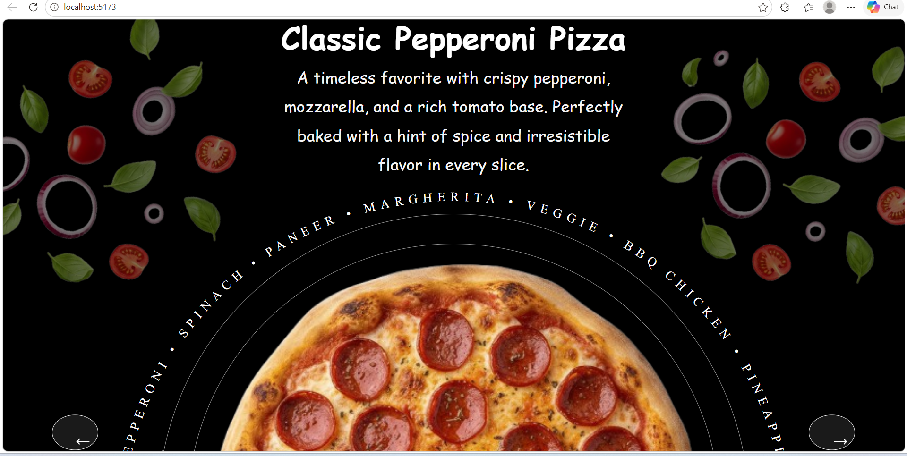

## 📌 Project Overview

This project showcases a <b>visually appealing and interactive web interface</b> built with a focus on <b>smooth animations, clean design, and user experience</b>.  

The goal was to create a web experience that is not just functional but also <b>feels dynamic and engaging</b>.

 

---

## ✨ Features

✔️ Clean and modern UI design  
✔️ Smooth animations and transitions  
✔️ Fully responsive layout  
✔️ Interactive user experience  
✔️ Optimized performance  

 

---

## 🛠️ Tech Stack

<b>Frontend:</b> 
• HTML5  
• CSS3  
• JavaScript  
• Vite (if used)  

 

---

## ⚙️ How It Works

• User interactions trigger smooth animations  
• Elements respond dynamically  
• Structured layout improves readability  
• Lightweight code ensures fast performance  

 

---

## 🎯 Learning Outcomes

✔️ Improved UI/UX understanding  
✔️ Hands-on animation experience  
✔️ Better frontend structuring  
✔️ Performance optimization skills  

📸 Preview

 

---

## 🚀 Future Improvements

🔹 Add advanced animations (GSAP)  
🔹 Improve accessibility  
🔹 Enhance mobile responsiveness  
🔹 Add more interactive features  

 

---

 

---

## 🤝 Connect With Me

If you like this project, feel free to connect and share your feedback! 🚀
